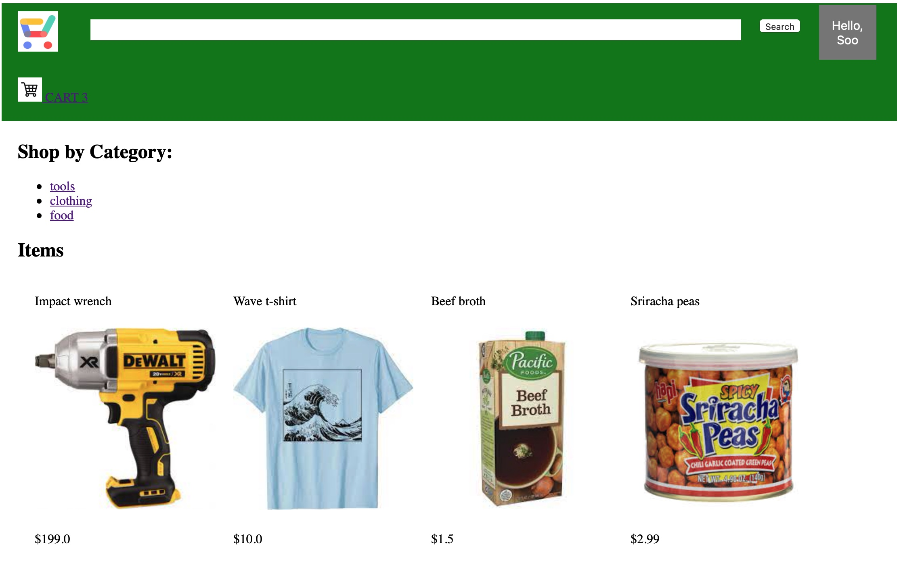

# my-ecommerce-store
 


An e-commerce website with users, items, shopping cart, etc. based on Python, SQLAlchemy and Flask.

You can create user profiles, change profiles, add and remove items to store, add and remove items to user cart.

This code uses SQLAlchemy to interface to the e-commerce store database.


## Store items:

We created a simple script so you can initialize your store items, inventory, description and stock.

We use a simple dataset of store items in `static/store_items`. The dataset format is composed of two files, one JSON with item details and one image. 

Details of the dataset structure are:


```
Category1/
		item11/
				data.txt
				image.jpg
Category2/ 
		item21/
				data.txt
				image.jpg
```

the data in `data.txt` is a JSON as follows:

```
{ 
  "name":"Wave t-shirt",
  "price":10.0,
  "description":"a t-shirt with a wave on it",
  "stock":5
}
```

The image is a picture of the item (.jpg).


## Run:

Web serving:

```
python app.py
```

Note: Before serving, the app initializes the store database from `static/store_items`. You can add / remove items online with: `http://127.0.0.1:5000/add_to_store` or `http://127.0.0.1:5000/remove_from_store` (clock on items to remove them from the store).


You can remove the database file `my_ecommerce.db` but be careful not to delete other users tables. Make a copy first!


###### References:

- https://www.tutorialspoint.com/sqlite/sqlite_python.htm
- https://github.com/HarshShah1997/Shopping-Cart
- https://docs.sqlalchemy.org/en/14/index.html
